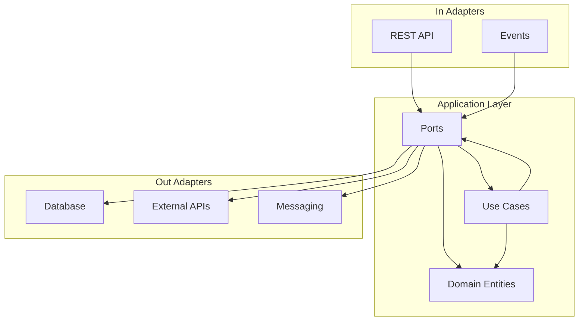

# Backend Architecture

## Overview

Spring Boot application using **Hexagonal Architecture** (Ports & Adapters) with Java 21.

## Architecture Layers



## Package Structure

```
backend/src/main/java/com/bau/
├── adapter/                 # All adapters
│   ├── in/                  # Driving adapters (controllers, events)
│   │   ├── web/             # REST controllers
│   │   └── event/           # Event listeners
│   └── out/                 # Driven adapters (repositories, external services)
│       ├── persistence/     # Database repositories
│       ├── web/            # External API clients
│       └── messaging/       # Message brokers
├── application/             # Application layer
│   ├── domain/              # Domain entities and business logic
│   ├── usecase/             # Use case implementations
│   └── port/                # Port interfaces
│       ├── in/              # Input ports (use case interfaces)
│       └── out/             # Output ports (repository interfaces)
└── shared/                  # Shared utilities and configuration
    ├── config/              # Configuration classes
    ├── util/                # Utility classes
    └── exception/           # Custom exceptions
```

## Key Components

### 1. Domain Layer (`application/domain/`)
- **Purpose**: Business logic and domain rules
- **Contains**: Entities, value objects, domain services
- **Dependencies**: None (pure business logic)

```java
@Data
@Builder(toBuilder = true)
@NoArgsConstructor
@AllArgsConstructor
@Accessors(chain = true, fluent = false)
public class Bedarf {
    private UUID id;
    private UUID betriebId;
    private Integer holzbauAnzahl;
    private Integer zimmermannAnzahl;
    private LocalDate datumVon;
    private LocalDate datumBis;
    private String adresse;
    private Boolean mitWerkzeug;
    private Boolean mitFahrzeug;
    private BedarfStatus status;
    
    /**
     * Validates if the date range is valid (end date after start date).
     */
    public boolean isValidDateRange() {
        return datumVon != null && datumBis != null && datumBis.isAfter(datumVon);
    }
    
    /**
     * Checks if tools are required for this bedarf.
     */
    public boolean requiresTools() {
        return Boolean.TRUE.equals(mitWerkzeug) && (holzbauAnzahl > 0 || zimmermannAnzahl > 0);
    }
    
    /**
     * Gets the total number of workers needed.
     */
    public int getTotalWorkers() {
        return (holzbauAnzahl != null ? holzbauAnzahl : 0) + 
               (zimmermannAnzahl != null ? zimmermannAnzahl : 0);
    }
}
```

### 2. Use Cases (`application/usecase/`)
- **Purpose**: Application business logic
- **Contains**: Use case implementations
- **Dependencies**: Domain entities, input/output ports

```java
@Service
@Slf4j
public class CreateBedarfUseCase {
    private static final Logger log = LoggerFactory.getLogger(CreateBedarfUseCase.class);
    
    private final BedarfRepository bedarfRepository;
    private final BedarfMapper bedarfMapper;
    
    public Optional<Bedarf> execute(CreateBedarfRequest request) {
        Bedarf bedarf = bedarfMapper.toDomain(request);
        
        if (!bedarf.isValidDateRange()) {
            log.info("End date must be after start date {}", request.getId());
            return Optional.empty();
        }
        
        Bedarf savedBedarf = bedarfRepository.save(bedarf);
        log.info("Successfully created bedarf with id: {}", savedBedarf.getId());
        
        return Optional.of(savedBedarf);
    }
}
```

### 3. Ports (`application/port/`)
- **Purpose**: Interface definitions
- **Contains**: Input ports (use case interfaces), output ports (repository interfaces)

```java
public interface CreateBedarfUseCase {
    Bedarf execute(CreateBedarfRequest request);
}

public interface BedarfRepository {
    Bedarf save(Bedarf bedarf);
    Optional<Bedarf> findById(Long id);
    List<Bedarf> findByBetriebId(Long betriebId);
}
```

### 4. Driving Adapters (`adapter/in/`)
- **Purpose**: Handle external requests
- **Contains**: REST controllers, CLI commands, event listeners

```java
@RestController
@RequiredArgsConstructor
@Slf4j
public class BedarfApiController implements BedarfApi {
    
    private final BedarfUseCase bedarfUseCase;
    private final BedarfWebMapper bedarfWebMapper;
    
    @Override
    public ResponseEntity<BedarfResponseDto> createBedarf(BedarfCreateRequestDto bedarfCreateRequestDto) {
        log.debug("Creating bedarf: {}", bedarfCreateRequestDto);
        
        Optional<Bedarf> bedarfOpt = bedarfUseCase.createBedarf(bedarfCreateRequestDto);
        
        if (bedarfOpt.isEmpty()) {
            log.warn("Bedarf creation failed");
            return ResponseEntity.badRequest().build();
        }
        
        BedarfResponseDto response = bedarfWebMapper.toResponseDto(bedarfOpt.get());
        log.info("Successfully created bedarf with id: {}", bedarfOpt.get().getId());
        
        return ResponseEntity.status(HttpStatus.CREATED).body(response);
    }
    
    @Override
    public ResponseEntity<List<BedarfResponseDto>> getAllBedarfe(/* pagination params */) {
        List<Bedarf> bedarfe = bedarfUseCase.getAllBedarfe();
        List<BedarfResponseDto> response = bedarfe.stream()
            .map(bedarfWebMapper::toResponseDto)
            .toList();
        return ResponseEntity.ok(response);
    }
    
    // ... other CRUD operations
}
```

### 5. Driven Adapters (`adapter/out/`)
- **Purpose**: External system integration
- **Contains**: Database repositories, external API clients

```java
@Repository
@RequiredArgsConstructor
@Slf4j
public class JpaBedarfRepository implements BedarfRepository {
    private static final Logger log = LoggerFactory.getLogger(JpaBedarfRepository.class);
    
    private final BedarfJpaRepository jpaRepository;
    private final BedarfEntityMapper mapper;
    
    @Override
    public Bedarf save(Bedarf bedarf) {
        log.debug("Saving bedarf entity for betrieb: {}", bedarf.getBetriebId());
        
        BedarfEntity entity = mapper.toEntity(bedarf);
        BedarfEntity saved = jpaRepository.save(entity);
        Bedarf result = mapper.toDomain(saved);
        
        log.debug("Successfully saved bedarf with id: {}", result.getId());
        return result;
    }
    
    @Override
    public Optional<Bedarf> findById(UUID id) {
        return jpaRepository.findById(id).map(mapper::toDomain);
    }
    
    @Override
    public List<Bedarf> findByBetriebId(UUID betriebId) {
        return jpaRepository.findByBetriebId(betriebId)
                .stream()
                .map(mapper::toDomain)
                .collect(Collectors.toList());
    }
}
```

## Data Flow

```
HTTP Request → Controller → Use Case → Domain → Repository → Database
Database → Repository → Domain → Use Case → Controller → HTTP Response
```

## Benefits

- **Testability**: Each layer can be tested independently
- **Maintainability**: Clear separation of concerns
- **Flexibility**: Easy to change implementations
- **Scalability**: Well-defined boundaries

## Related
- [Entity & DTO Separation](../09-architecture-decisions/adr-003-entity-dto-separation.md) - Object types
- [Naming Conventions](../09-architecture-decisions/adr-004-naming-conventions.md) - Naming guidelines
- [Development Guide](../development.md) - Setup and development 