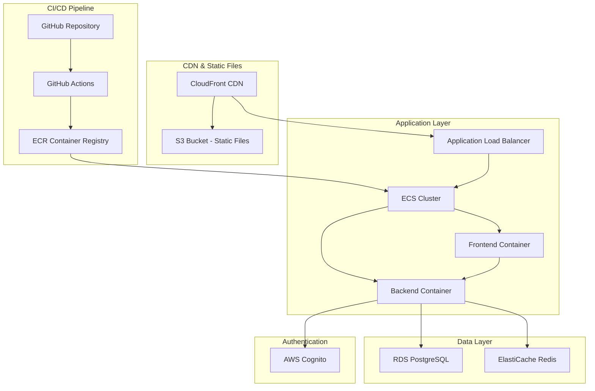

# Deployment Guide

## Overview

Production deployment using Docker containers on AWS ECS with RDS PostgreSQL, automated via GitHub Actions CI/CD pipeline.

## Architecture



## CI/CD Pipeline

### GitHub Actions Workflows

#### 1. Continuous Integration (`ci.yml`)
**Triggers**: Push to `main`/`develop`, pull requests

**Jobs**:
- **Backend Tests**: Unit and integration tests with PostgreSQL service
- **Frontend Tests**: Linting and unit tests with coverage
- **Security Scan**: Trivy vulnerability scanner
- **Build**: Create artifacts (JAR + frontend dist)

**Features**:
- Caching for Maven and npm dependencies
- Test result artifacts
- Security scanning with SARIF output
- Parallel job execution

#### 2. Staging Deployment (`cd-staging.yml`)
**Triggers**: Push to `develop` branch

**Jobs**:
- **Build and Push**: Create Docker images and push to ECR
- **Deploy Backend**: Update ECS service with new image
- **Deploy Frontend**: Update ECS service with new image
- **Notify**: Slack notification with deployment status

**Features**:
- Automatic deployment on develop branch
- Docker image versioning with git SHA
- ECS service stability checks
- Slack notifications

#### 3. Production Deployment (`cd-production.yml`)
**Triggers**: Manual workflow dispatch

**Jobs**:
- **Approval**: Manual approval step with required approvers
- **Deploy Backend**: Production deployment after approval
- **Deploy Frontend**: Production deployment after approval
- **Health Check**: Post-deployment health verification
- **Notify**: Slack notification with deployment status

**Features**:
- Manual approval workflow
- Version selection input
- Health checks after deployment
- Slack notifications

### Required GitHub Secrets

```bash
# AWS Credentials
AWS_ACCESS_KEY_ID=your_access_key
AWS_SECRET_ACCESS_KEY=your_secret_key

# Slack Notifications
SLACK_WEBHOOK_URL=https://hooks.slack.com/services/...

# Production Approval
APPROVAL_SECRET=your_approval_secret
APPROVERS=username1,username2
```

## Prerequisites

- **AWS CLI** configured
- **Docker** installed
- **Terraform** (for infrastructure)
- **Domain name** configured
- **GitHub repository** with Actions enabled

## Infrastructure Setup

### 1. Create Infrastructure
```bash
# Clone infrastructure repo
git clone https://github.com/your-org/bau-infrastructure.git
cd bau-infrastructure

# Initialize Terraform
terraform init

# Plan deployment
terraform plan -var-file=environments/prod.tfvars

# Apply infrastructure
terraform apply -var-file=environments/prod.tfvars
```

### 2. Environment Variables
```env
# Production environment
AWS_REGION=eu-central-1
AWS_COGNITO_USER_POOL_ID=eu-central-1_xxxxxxxxx
AWS_COGNITO_CLIENT_ID=xxxxxxxxxxxxxxxxxxxxxxxxxx
SPRING_DATASOURCE_URL=jdbc:postgresql://bau-prod.cluster-xyz.eu-central-1.rds.amazonaws.com:5432/bau_prod
SPRING_DATASOURCE_USERNAME=bau_prod_user
SPRING_DATASOURCE_PASSWORD=secure_password_here
```

## Application Deployment

### Automated Deployment (Recommended)
The GitHub Actions workflows handle all deployment automatically:

1. **Development**: Push to `develop` → automatic staging deployment
2. **Production**: Manual workflow dispatch → approval → production deployment

### Manual Deployment (Fallback)
```bash
# Build Images
docker build -t bau-backend:latest ./backend
docker tag bau-backend:latest 123456789012.dkr.ecr.eu-central-1.amazonaws.com/bau-backend:latest

docker build -t bau-frontend:latest ./frontend
docker tag bau-frontend:latest 123456789012.dkr.ecr.eu-central-1.amazonaws.com/bau-frontend:latest

# Push to ECR
aws ecr get-login-password --region eu-central-1 | docker login --username AWS --password-stdin 123456789012.dkr.ecr.eu-central-1.amazonaws.com
docker push 123456789012.dkr.ecr.eu-central-1.amazonaws.com/bau-backend:latest
docker push 123456789012.dkr.ecr.eu-central-1.amazonaws.com/bau-frontend:latest

# Deploy to ECS
aws ecs update-service --cluster bau-cluster --service bau-backend --force-new-deployment
aws ecs update-service --cluster bau-cluster --service bau-frontend --force-new-deployment
```

## Docker Configuration

### Backend Dockerfile
```dockerfile
FROM openjdk:21-jdk-slim

WORKDIR /app

COPY target/bau-backend-*.jar app.jar

EXPOSE 8080

ENTRYPOINT ["java", "-jar", "app.jar"]
```

### Frontend Dockerfile
```dockerfile
FROM nginx:alpine

COPY dist/bau-frontend /usr/share/nginx/html
COPY nginx.conf /etc/nginx/nginx.conf

EXPOSE 80

CMD ["nginx", "-g", "daemon off;"]
```

### Docker Compose (Development)
```yaml
version: '3.8'

services:
  postgres:
    image: postgres:15
    environment:
      POSTGRES_DB: bau_dev
      POSTGRES_USER: bau_user
      POSTGRES_PASSWORD: bau_password
    ports:
      - "5432:5432"
    volumes:
      - postgres_data:/var/lib/postgresql/data

  backend:
    build: ./backend
    ports:
      - "8080:8080"
    environment:
      SPRING_DATASOURCE_URL: jdbc:postgresql://postgres:5432/bau_dev
      SPRING_DATASOURCE_USERNAME: bau_user
      SPRING_DATASOURCE_PASSWORD: bau_password
    depends_on:
      - postgres

  frontend:
    build: ./frontend
    ports:
      - "4200:80"
    depends_on:
      - backend

volumes:
  postgres_data:
```

## Monitoring and Logging

### CloudWatch Logs
```yaml
# Backend logging configuration
logging:
  driver: awslogs
  options:
    awslogs-group: /ecs/bau-backend
    awslogs-region: eu-central-1
    awslogs-stream-prefix: ecs
```

### Health Checks
```yaml
# ECS service health check
healthCheck:
  command:
    - CMD-SHELL
    - curl -f http://localhost:8080/actuator/health || exit 1
  interval: 30
  timeout: 5
  retries: 3
  startPeriod: 60
```

## Security

### Secrets Management
- Use AWS Secrets Manager for database passwords
- Store Cognito credentials in secure environment variables
- Enable VPC for ECS tasks
- Use IAM roles for service permissions

### Network Security
- Application Load Balancer with HTTPS
- VPC with private subnets for ECS tasks
- Security groups limiting access
- WAF for additional protection

### CI/CD Security
- GitHub Actions secrets for sensitive data
- Trivy vulnerability scanning
- SARIF integration with GitHub Security tab
- Manual approval for production deployments

## Deployment Environments

### Development
- **Branch**: `develop`
- **Deployment**: Automatic on push
- **Environment**: Staging
- **URL**: `https://staging.bau.ch`

### Production
- **Branch**: `main`
- **Deployment**: Manual approval
- **Environment**: Production
- **URL**: `https://bau.ch`

## Troubleshooting

### Common Issues
1. **ECS Service Not Updating**: Check task definition and service configuration
2. **Health Check Failures**: Verify application health endpoint
3. **Database Connection Issues**: Check security groups and credentials
4. **GitHub Actions Failures**: Review workflow logs and secrets configuration

### Rollback Procedure
```bash
# Rollback to previous version
aws ecs update-service --cluster bau-cluster --service bau-backend --task-definition bau-backend:previous-version
aws ecs update-service --cluster bau-cluster --service bau-frontend --task-definition bau-frontend:previous-version
```

## Related Documentation
- [CI/CD Pipeline](../08-cross-cutting-concepts/ci-cd-pipeline.md)
- [Infrastructure Setup](../05-building-blocks/infrastructure.md)
- [Monitoring and Alerting](../06-runtime/monitoring.md) 